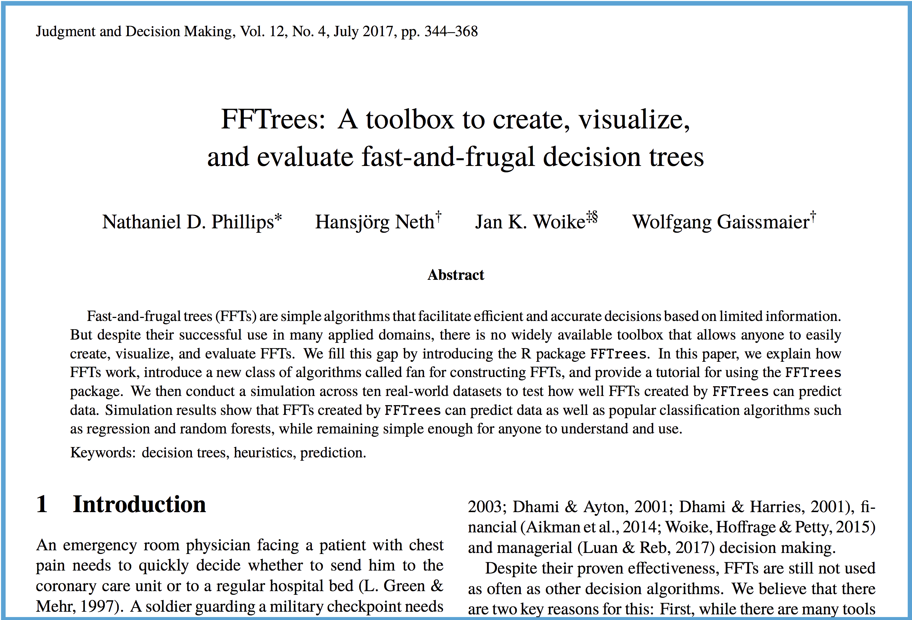
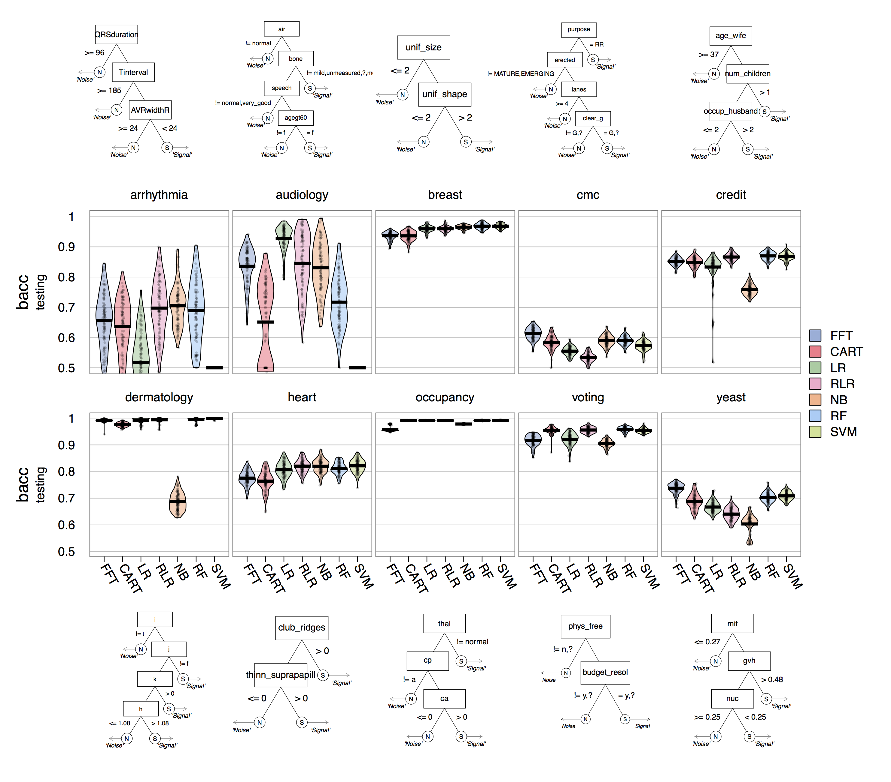

```{r, echo = FALSE, message = FALSE}
library(FFTrees)
```

<link rel="stylesheet" href="../font-awesome-4.7.0/css/font-awesome.min.css">

## Why simplicity matters

> Simplicity is the ultimate sophistication ~ Leonardo da Vinci

> The art of being wise is the art of knowing what to overlook ~ William James

> If [an algorithm] that measures up very well on the performance criterion is nevertheless totally incomprehensible to a human expert, can it be described as knowledge? Under the common-sense definition of this term [...] it is not ~ Quinlan (1999)

Data scientists are blessed with a plethora of advanced machine learning algorithms that they can easily apply to their data using R, from regression, to random forests, to support vector machines. How do data scientists select a machine learning algorithm for a specific task? In most cases, I'd bet they'll focus on one criterion: prediction accuracy. That is, the algorithm with the best prediction performance, regardless of how *much* better it is than other algorithms, and regardless of how *interpretable* it is, will win out.

But there is a problem. If we evaluate algorithms *only* by their ranked prediction performance, then we may surround ourselves with algorithms that are completely incomprehensible (see [The Dark Secret at the Heart of AI](https://www.technologyreview.com/s/604087/the-dark-secret-at-the-heart-of-ai/)), provide no insight to the data, use wasteful and distracting information, and when they fail, provide little to no guidance as to what exactly went wrong.

Instead, if in addition to pure prediction accuracy, we evaluate algorithms based on their insight, frugality, comprehensibility, and error guidance, we may select simple, comprehensible, frugal algorithms that provide real insight and decision-making guidance.

Moreover, after comparing the performance of simple to complex algorithms, we may find that the relationship between model complexity and prediction performance is much weaker than intuition might suggest. Indeed, simple algorithms may perform just as well, and even better, than their black-box counterparts (Gigerenzer & Brighton, 2009).


#### 4 criteria for selecting an algorithm (that have nothing to do with accuracy)

- *Insight*: What does the algorithm tell us about the data? After evaluating an algorithm, what do we know about the data that we did not know before? How can the algorithm inspire new questions and models?

- *Comprehensibility*: Will the algorithm be understood and accepted by a statistically novice audience that may be skeptical that an algorithm can replace human expertise?

- *Frugality*: Does the algorithm only use information that is necessary or does it also use a pile of relatively useless junk that is potentially more distracting than helpful to decision makers?

- *Error Guidance*: If the algorithm starts performing poorly in a new dataset, will the algorithm be able to show us what exactly went wrong? Or, will it provide no such guidance and require users to 'start from scratch'?


## Fast-and-frugal Trees (FFTs)

One class of algorithms that excel in each of these four areas are *fast-and-frugal decision trees* (FFTs). FFTs are highly restricted decision trees that try to use as little information as possible in making binary classification decisions. Formally, they are decision trees with two branches under each node, where one (or both) branches are exit branches that trigger an immediate decision (Martignon et al., 2008).

While there are many great packages (such as [rpart](https://cran.r-project.org/web/packages/rpart/index.html)) that create decision trees that may or may not be fast-and-frugal, there are fewer packages that explicitly create fast-and-frugal trees. The [FFTrees](https://cran.r-project.org/web/packages/FFTrees/index.html) package is one of them.


A few months ago, I wrote a [blog post](http://nathanieldphillips.com/2016/08/making-fast-good-decisions-with-the-fftrees-r-package/) introducing FFTrees. But for new users, let's do a quick example. We'll use FFTrees applied to a dataset of medical patients to to classify patients as either having or not having heart disease on the basis of both demographic information and medical tests. Here is how the first few rows of the heartdisease dataset look:

```{r, echo = FALSE, fig.cap="The heartdisease dataset"}
x <- cbind(heartdisease$diagnosis, heartdisease[,names(heartdisease) != "diagnosis"])
names(x)[1] <- "diagnosis"

knitr::kable(head(x), caption = "The heartdisease dataset")
```

In the code chunk below I will use FFTrees to create an FFT predicting the binary classification variable `diagnosis`:

```{r, echo = TRUE, message = FALSE, fig.width = 6.5, fig.height = 6, out.width = "100%", fig.align='center'}

# install.packages("FFTrees") # Install FFTrees from CRAN
library(FFTrees)

# Create an FFTrees object predicting heart disease
heart.fft <- FFTrees(formula = diagnosis ~.,
                     data = heart.train,              # Training data
                     data.test = heart.test,          # Testing data (optional) 
                     main = "Heart Disease FFT",      # Some optional labels passed to other functions
                     decision.labels = c("Low-risk", "High-risk"))
```

Now let's plot the object `heart.fft`. As you will see, this plot will show us almost everything we could want to know about the algorithm and how it performed:

```{r,  fig.width = 6.5, fig.height = 6, out.width = "100%"}
# Plot the result with accuracy statistics in testing data
plot(heart.fft, data = "test")
```

For more information about using the package, check out the [package guide](https://cran.r-project.org/web/packages/FFTrees/vignettes/guide.html).

## 3 updates to the FFTrees universe

Now, let's get to the three updates in the FFTrees universe

### 1) Phillips, Neth, Woike & Gaissmaier (2017)

- [PDF: FFTrees: A toolbox to create, visualize, and evalute fast-and-frugal decision trees](http://journal.sjdm.org/17/17217/jdm17217.pdf).



We ([myself](http://ndphillips.github.io), [Hansjörg Neth](https://www.spds.uni-konstanz.de/hans-neth), [Jan Woike](https://www.mpib-berlin.mpg.de/en/staff/jan-k-woike) and [Wolfgang Gaissmaier](https://www.spds.uni-konstanz.de/wolfgang-gaissmaier)) recently published a paper in the journal of [Judgment and Decision Making](http://www.sjdm.org/journal/) titled *FFTrees: A toolbox to create, visualize, and evaluate fast-and-frugal decision trees*. In the paper, we explain how FFTs work, how the algorithms in FFTrees build FFTs, and then show how well FFTs can predict data relative to more complex algorithms.

For example, in a prediction simulation, we found that, across 10 real world datasets, FFTs can predict data as well as many other algorithms ranging from non--frugal decision trees (CART), to, regularized logistic regression (RLR), to random forests (RF) and support vector machines (SVM). 

Spoiler alert: FFTs can perform just as well as these algorithms. The plot below shows the distribution of prediction performance (measured by balanced accuracy, the average of specificity and sensitivity) of each algorithm in each dataset, as well as an example FFT created for that dataset. As you can see, FFTs (always on the far left in each plot), were very competitive with all other algorithms in every dataset.



The paper is free to view on the Society for Judgment and Decision Making website at [http://journal.sjdm.org/17/17217/jdm17217.pdf](http://journal.sjdm.org/17/17217/jdm17217.pdf).


### 2) FFTrees v1.3.3

FFTrees v1.3.3 has several new features. Here are a few of them:

*Manually define and test your own FFT 'in words'*

Because FFTs are so simple, it's easy to define an FFT verbally, and then have R convert the verbal definition to an FFTrees object. For example, let's say you wanted to see how well an alternative heart disease FFT performs that only uses the cues `age` and `thal`. You can easily specify such a tree as a character string "If age > 60, predict True. If thal = {rd,fd}, predict True. Otherwise, predict False":

```{r, message = FALSE}
# Define an FFT verbally using the my.tree argument
# Braces indicate factors

my.heart.fft <- FFTrees(formula = diagnosis ~.,
                        data = heartdisease,
                        my.tree = "If age > 60, predict True.
                                   If thal = {rd,fd}, predict True. Otherwise, predict False")
```

Running this code will bypass the FFT construction algorithms, and apply the specific tree we defined to the data. This is a great way to play around with different trees and test how different decision thresholds and cue orders affect decisions.


*Multiple FFT building algorithms*

FFTrees v1.3.3 now contains several algorithms for building FFTs. From the *ifan* and *dfan* algorithms developed specifically for the FFTrees package, to the max and zig-zag algorithms introduced by Martignon et al. (2008).

*Include cue costs*

If your data contains predictors that have real costs to use (i.e.; medical tests), you can now include those costs as an argument `cost.cues` to FFTrees. When you do so, the tree building algorithm will select predictors as a joint function of their prediction accuracy *and* their costs. *Note: This is an experimental feature that hasn't been fully tested*

```{r, message = FALSE, eval = FALSE}
# Create FFTs that minimize costs of predictors (i.e.; medical testing costs) and outcomes

my.heart.fft <- FFTrees(formula = diagnosis ~.,
                        data = heartdisease,
                        
                        # Include costs of some cues
                        cost.cues = data.frame("cue" = c("thal", "cp", "ca"),
                                               "cost" = c(102.9, 1.00, 100.9)),
                        
                        # Include cost of outcomes (hits, false-alarms, misses, and correct rej)
                        cost.outcomes = c(0, 50, 50, 0),
                        
                        # Tell the algorithm to minimize costs
                        goal = 'cost',
                        goal.chase = 'cost')
```

<!-- For example, the dataframe `heart.cost` contains a cost for each predictor in the dataset. -->

<!-- ```{r, echo = FALSE} -->
<!-- knitr::kable(heart.cost) -->
<!-- ``` -->


<!-- For example, here is a heartdisease FFT created ignoring cue costs. This tree will use the default values of `goal = 'bacc'` and `goal.chase = 'bacc'`  -->

<!-- ```{r, message = FALSE} -->
<!-- # Create a tree using default -->
<!-- heart.nc.fft <- FFTrees(formula = diagnosis ~., -->
<!--                         data = heartdisease, -->
<!--                         goal = "bacc", -->
<!--                         goal.chase = "bacc", -->
<!--                         cost.cues = heart.cost, -->
<!--                         cost.outcomes = c(0, 1, 1, 0)) -->

<!-- # Show tree 'in words' -->
<!-- inwords(heart.nc.fft)$v1 -->

<!-- # What is the overall accuracy? -->
<!-- heart.nc.fft$tree.stats$train$bacc[1] -->

<!-- # What is the average cost? -->
<!-- mean(heart.nc.fft$cost$train$total[,1]) -->
<!-- ``` -->

<!-- This tree uses the cues thal (cost of \$102.90), cp (cost of \$1.00) and ca (cost of \$100.90) and has a balanced accuracy of around 81%, at a mean cost of $121. -->

<!-- Now, let's do it again, but this time we'll tell the algorithm to minimize costs by setting `goal = 'cost'` and `goal.chase = 'cost'` -->

<!-- ```{r, message = FALSE} -->
<!-- heart.cost.fft <- FFTrees(formula = diagnosis ~., -->
<!--                         data = heartdisease, -->
<!--                         cost.cues = heart.cost, -->
<!--                         cost.outcomes = c(0, 1, 1, 0), -->
<!--                         goal = "cost", -->
<!--                         goal.chase = "cost") -->

<!-- # Show tree 'in words' -->
<!-- inwords(heart.cost.fft)$v1 -->

<!-- # What is the overall accuracy? -->
<!-- heart.cost.fft$tree.stats$train$bacc[1] -->

<!-- # What is the average cost? -->
<!-- mean(heart.cost.fft$cost$train$total[,1]) -->
<!-- ``` -->

<!-- This tree , has only a slightly lower balanced accuracy of around 77%, but at a *much* lower mean cost of only $2 because it is using much cheaper predictors: cp (cost of \$1.00) age (cost of \$1) and sex (cost of \$1) -->

*Missing Values*

Missing values, both in the predictors (aka cues, features) and the criterion, are now acceptable. Cases with missing values in predictors will simply be classified by the first decision node containing a non-missing predictor.

### 3) ShinyFFTrees

- ShinyFFTrees Link: [https://econpsychbasel.shinyapps.io/shinyfftrees/](https://econpsychbasel.shinyapps.io/shinyfftrees/)

If you want to use FFTrees, but don't want to fire up R, there's also ShinyFFTrees. ShinyFFTrees is a [Shiny](http://shiny.rstudio.com) app that allows you to utilize most of the features of the FFTrees package entirely in a web-browser. The app contains most of the functionality of the R package, and even lets you create FFTs from your own, uploaded data.

Here is ShinyFFTrees displayed within this page (performance is better if you open the link in a new window):

<iframe src="https://econpsychbasel.shinyapps.io/shinyfftrees/", height = 500px, width = 900px, align = middle></iframe>


### Conclusion

There is no free lunch in machine learning algorithms (Wolpert, 1996). No one algorithm is better than another *a priori*. For some decision tasks, complex black box algorithms such as deep learning and random forests will be appropriate. For other tasks, simple algorithms will perform just as well or even better than complex algorithms, while providing meaningful insights that otherwise would have been buried in a mountain of 'big data'. We hope that, for those tasks, FFTrees will provide a valuable tool.

### Collaborate and Contact us!

GitHub: <a href = "https://github.com/ndphillips/ShinyFFTrees"><i class='fa fa-github fa-3x'></i></a>
Email: <a href = mailto:Nathaniel.D.Phillips.is@gmail.com?Subject=ShinyFFTrees><i class='fa fa-envelope-o fa-3x'></i></a>
                
We are very interested in collaborations and user feedback on FFTrees. If you use FFTrees for your own data, and have spectacular successes (or failures), or could use a critical new feature, please contact me at Nathaniel.D.Phillips.is\@gmail.com, or post an issue on [GitHub](https://github.com/ndphillips/FFTrees).


# References

Gigerenzer, G., & Brighton, H. (2009). Homo heuristicus: Why biased minds make better inferences. Topics in cognitive science, 1(1), 107-143.

Martignon, L., Katsikopoulos, K. V., & Woike, J. K. (2008). Categorization with limited resources: A family of simple heuristics. Journal of Mathematical Psychology, 52(6), 352–361.

Phillips, N. D., Neth, H., Woike, J. K., & Gaissmaier, W. (2017). FFTrees: A toolbox to create, visualize, and evaluate fast-and-frugal decision trees. Judgment and Decision Making, 12(4), 344-368.

Quinlan, J. R. (1987). Simplifying decision trees. International journal of man-machine studies, 27(3), 221-234.

Wolpert, D. H. (1996). The existence of a priori distinctions between learning algorithms. Neural Computation, 8(7), 1391–1420.
  