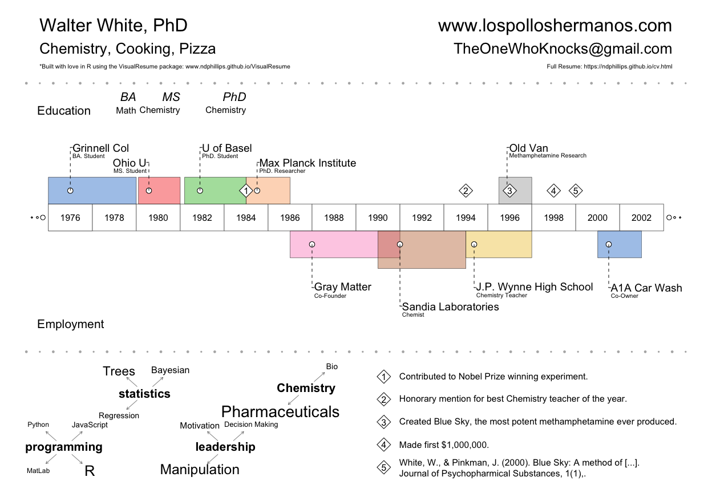

Introducing the VisualResume (v0.1.0) R Package
================
January 3 2017

Visual Resumes are cool
-----------------------

Some years ago, during the course of one of my regular Google image searches for inspiring designs, I discovered Visual Resumes (aka. Infographic Resumes) like this one from [Michael Anderson](https://venngage-wordpress.s3.amazonaws.com/uploads/2016/05/michael-anderson.png). I immediately fell in love. And of course, I quickly set out to create my own in R. The result is a new package called `VisualResume`. The main function in the package, `VisualResume()` will create a visual resume like the one below for our favorite anti-hero [Walter White](https://en.wikipedia.org/wiki/Walter_White_(Breaking_Bad)):



### Intallation

Version `v0.1.0` of `VisualResume` is available on GitHub at <http://www.github.com/ndphillips/VisualResume>.

To use `VisualResume`, first, install the package from GitHub:

``` r
install.packages("devtools") # Only if you don't have the devtools package
devtools::install_github("ndphillips/VisualResume")
```

### `VisualResume()`

The main function in the package is `VisualResume()`. When running `VisualResume()` you need to include several arguments that specify the content, size and location of the plotting elements. The function will automatically format the resume to fit your specifications.

#### Critical arguments:

Here are the critical arguments to the function:

<table style="width:83%;">
<colgroup>
<col width="15%" />
<col width="68%" />
</colgroup>
<thead>
<tr class="header">
<th>Argument</th>
<th>Definition</th>
</tr>
</thead>
<tbody>
<tr class="odd">
<td><code>titles.left</code>, <code>titles.right</code></td>
<td>Character vectors (length 3) indicating the header titles</td>
</tr>
<tr class="even">
<td><code>timeline</code></td>
<td>A dataframe with columns <code>title</code>, <code>sub</code>, <code>start</code>, <code>end</code>, <code>side</code>. The <code>title</code> and <code>sub</code> columns are character, <code>start</code> and <code>end</code> are integer, and <code>side</code> is binary (0 = bottom, 1 = top).</td>
</tr>
<tr class="odd">
<td><code>events</code></td>
<td>A dataframe with columns <code>title</code>, <code>year</code> specifying important events (e.g.; publications).</td>
</tr>
<tr class="even">
<td><code>interests</code></td>
<td>A list of named character vectors specifying interests. The more often a value occurs in a vector, the larger it will be displayed.</td>
</tr>
</tbody>
</table>

#### Optional arguments

Here are some of the optional function arguments that will either add new elements to the plot, or adjust the attributes of existing elements.

<table style="width:83%;">
<colgroup>
<col width="15%" />
<col width="68%" />
</colgroup>
<thead>
<tr class="header">
<th>Argument</th>
<th>Definition</th>
</tr>
</thead>
<tbody>
<tr class="odd">
<td><code>timeline.labels</code></td>
<td>Character vector (length 2) indicating labels for the top and bottom of the timeline</td>
</tr>
<tr class="even">
<td><code>events</code></td>
<td>A dataframe with columns <code>title</code>, <code>year</code> specifying important events (e.g.; publications).</td>
</tr>
<tr class="odd">
<td><code>interests</code></td>
<td>A list of named character vectors specifying interests. The more often a value occurs in a vector, the larger it will be displayed.</td>
</tr>
<tr class="even">
<td><code>milestones</code></td>
<td>A dataframe with columns <code>title</code>, <code>sub</code>, <code>year</code> specifying some milestones (e.g. degrees earned).</td>
</tr>
<tr class="odd">
<td><code>titles.right.cex</code>, <code>titles.left.cex</code></td>
<td>Numeric vectors specifying the size of the header titles.</td>
</tr>
<tr class="even">
<td><code>year.steps</code></td>
<td>An integer specifying the step size between year labels.</td>
</tr>
<tr class="odd">
<td><code>col</code>, <code>trans</code></td>
<td>The color, and transparencies, of timeline elements</td>
</tr>
</tbody>
</table>

### Customising timeline locations

`VisualResume()` will do its best to put plotting elements, like boxes and boxes, in reasonable locations in the timeline. However, it won't be perfect. In some cases, labels might overlap or just not look very elegant. If this happens, you can specify some plotting parameters in the `timeline` dataframe by including the columns `box.x0, box.x1, box.y1, box.y2`, which control the locations of the boxes, `point.x, point.y` which control the locations of the points, and `label.x, label.y, label.dir` which specify the locations and direction of the labels. See the help menu`?VisualResume` for additional details.

### Walter White's Visual Resume

Here is the code that generates the visual resume for Walter White (my apologies for any errors in the data!):

``` r
# Walter White's Visual Resume

VisualResume::VisualResume(
titles.left = c("Walter White, PhD", 
                "Chemistry, Cooking, Pizza", 
                "*Built with love in R using the VisualResume package: www.ndphillips.github.io/VisualResume"),
titles.left.cex = c(3, 2.5, 1),
titles.right.cex = c(3, 2.5, 1),
titles.right = c("www.lospolloshermanos.com", 
                 "TheOneWhoKnocks@gmail.com", 
                 "Full Resume: https://ndphillips.github.io/cv.html"),
timeline.labels = c("Education", "Employment"),
timeline = data.frame(title = c("Grinnell Col", "Ohio U", "U of Basel",
                                "Max Planck Institute", "Old Van", "Gray Matter",
                                "Sandia Laboratories", "J.P. Wynne High School", "A1A Car Wash"),
                      sub = c("BA. Student", "MS. Student", "PhD. Student", 
                              "PhD. Researcher", "Methamphetamine Research", "Co-Founder", 
                              "Chemist", "Chemistry Teacher", "Co-Owner"),
                      start = c(1976, 1980.1, 1982.2, 1985, 
                                1996.5, 1987, 1991, 1995, 2001),
                      end = c(1980, 1982, 1985, 1987, 1998, 
                              1992, 1995, 1998, 2003),
                      side = c(1, 1, 1, 1, 1, 0, 0, 0, 0)),
milestones = data.frame(title = c("BA", "MS", "PhD"),
                        sub = c("Math", "Chemistry", "Chemistry"),
                        year = c(1980, 1982, 1985)),
events = data.frame(year = c(1985, 1995, 1997, 1999, 2000),
                    title = c("Contributed to Nobel Prize winning experiment.",
                              "Honorary mention for best Chemistry teacher of the year.",
                              "Created Blue Sky, the most potent methamphetamine ever produced.",
                              "Made first $1,000,000.",
                              "White, W., & Pinkman, J. (2000). Blue Sky: A method of [...].\nJournal of Psychopharmical Substances, 1(1),.")),
interests = list("programming" = c(rep("R", 10), rep("Python", 1), rep("JavaScript", 2), "MatLab"),
                 "statistics" = c(rep("Trees", 10), rep("Bayesian", 5), rep("Regression", 3)),
                 "leadership" = c(rep("Motivation", 10), rep("Decision Making", 5), rep("Manipulation", 30)),
                 "Chemistry" = c(rep("Bio", 10), rep("Pharmaceuticals", 50))),
year.steps = 2
)
```

### Bug-reports

This package is very young and likely contains many bugs and room for improvement. Please submit bug reports and feature requests at <https://github.com/ndphillips/VisualResume/issues>
